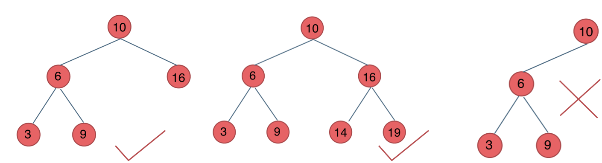
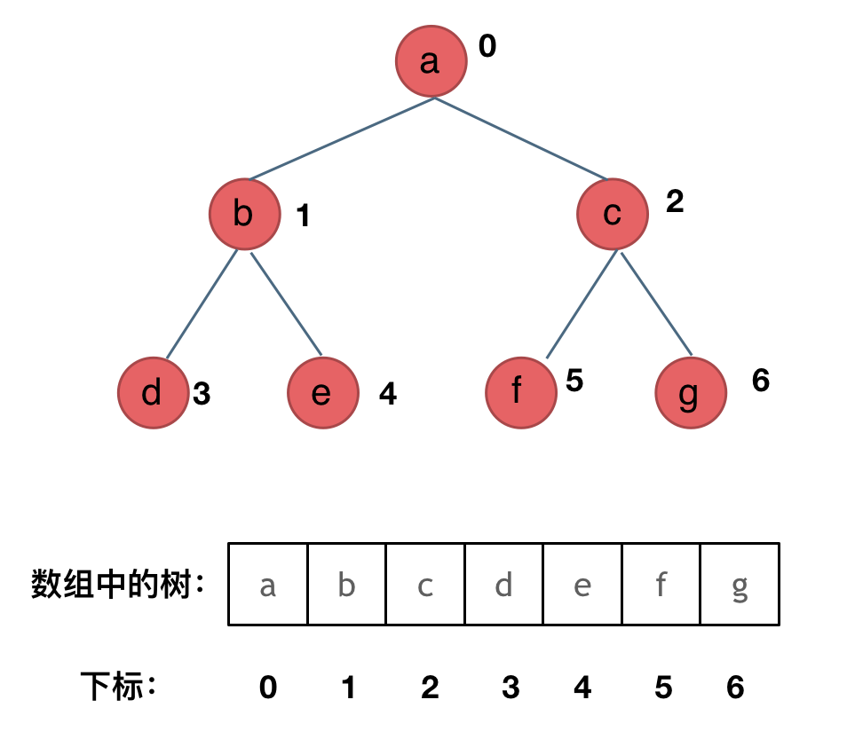
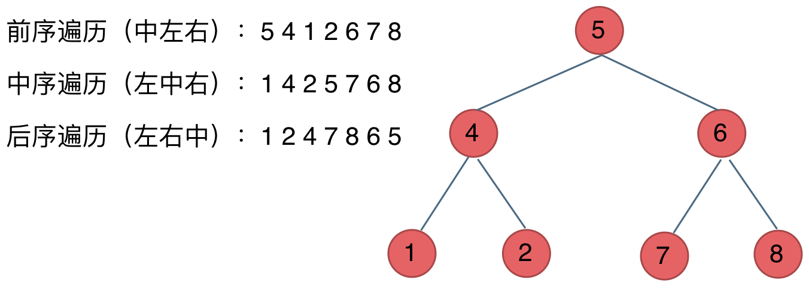

# 二叉树 part 1
## 二叉树理论基础
### 满二叉树
定义：一个二叉树，如果每一个层的结点数都达到最大值，则这个二叉树就是满二叉树。也就是说，如果一个二叉树的层数为K，且结点总数是(2^k) -1 ，则它就是满二叉树。

### 完全二叉树
定义：若设二叉树的深度为h，除第 h 层外，其它各层 (1～h-1) 的结点数都达到最大个数，第 h 层所有的结点都连续集中在最左边，这就是完全二叉树。该层包含 1~2^(h-1)个节点。

**堆就是一棵完全二叉树，同时保证父子节点的顺序关系**

### 二叉搜索树
有序树

* 若它的左子树不空，则左子树上所有结点的值均小于它的根结点的值；
* 若它的右子树不空，则右子树上所有结点的值均大于它的根结点的值；
* 它的左、右子树也分别为二叉排序树

### 平衡二叉搜索树 AVL
具有以下性质：它是一棵空树或它的左右两个子树的高度差的绝对值不超过1，并且左右两个子树都是一棵平衡二叉树。

### 二叉树的存储方式

**二叉树可以链式存储，也可以顺序存储。**

那么链式存储方式就用指针， 顺序存储的方式就是用数组。

顾名思义就是顺序存储的元素在内存是连续分布的，而链式存储则是通过指针把分布在各个地址的节点串联一起。

链式存储如图：

顺序存储：

用数组来存储二叉树如何遍历的呢？

如果父节点的数组下标是 i，那么它的左孩子就是 i * 2 + 1，右孩子就是 i * 2 + 2。

但是用链式表示的二叉树，更有利于我们理解，所以一般我们都是用链式存储二叉树。

所以大家要了解，用数组依然可以表示二叉树。

### 二叉树的遍历方式

这里前中后，其实指的就是中间节点的遍历顺序，只要大家记住 前中后序指的就是中间节点的位置就可以了。

看如下中间节点的顺序，就可以发现，中间节点的顺序就是所谓的遍历方式

* 前序遍历：中左右
* 中序遍历：左中右
* 后序遍历：左右中

最后再说一说二叉树中深度优先和广度优先遍历实现方式，我们做二叉树相关题目，经常会使用递归的方式来实现深度优先遍历，也就是实现前中后序遍历，使用递归是比较方便的。

之前我们讲栈与队列的时候，就说过栈其实就是递归的一种实现结构，也就说前中后序遍历的逻辑其实都是可以借助栈使用递归的方式来实现的。

而广度优先遍历的实现一般使用队列来实现，这也是队列先进先出的特点所决定的，因为需要先进先出的结构，才能一层一层的来遍历二叉树。

## 二叉树的递归遍历
1. 确定递归函数的参数返回值
2. 确定终止条件
3. 确定单层递归的逻辑

## 二叉树的非递归遍历
通过遍历栈来实现，前序和后序实现方式类似

### 前序和后序
栈用来存将要处理但还未遍历过的元素

### 中序
栈用来存遍历过了但未处理的元素

## 统一迭代
暂时跳过

## 层序遍历
用队列完成，需要记录每一层的节点数

