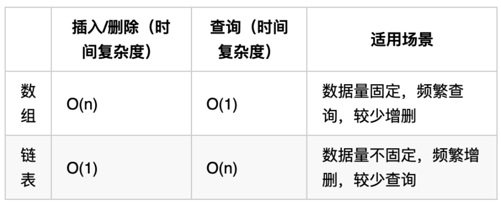

# 链表 part 1
# 链表
## 链表的类型
* 单链表：指针域只指向下一个节点，无法直接找到previous node
* 双链表：指针域同时指向next和previous
* 循环链表：类似于单链表，但最后一个node的next指针指向第一个node

## 链表的存储方式
并非在内存中连续分布，通过指针域的指针链接节点

## 链表的定义
```{java}
public class ListNode {
    // 结点的值
    int val;

    // 下一个结点
    ListNode next;

    // 节点的构造函数(无参)
    public ListNode() {
    }

    // 节点的构造函数(有一个参数)
    public ListNode(int val) {
        this.val = val;
    }

    // 节点的构造函数(有两个参数)
    public ListNode(int val, ListNode next) {
        this.val = val;
        this.next = next;
    }
}
```

## 链表的添加和删除节点操作
本质都通过更改对应节点的next索引来实现，操作本身的复杂度为O(1)，然而查找第n个节点需要从第一个节点一个个遍历过去，故查找操作的复杂度为O(n)

## 性能分析


# 203.移除链表元素
有两种主要的思路：
* 直接使用原来的链表进行删除操作
* 设置一个虚拟头节点再进行删除操作

主要区别在于，如果直接使用原来的链表，那么对于Head，就需要进行一次额外的判断，避免head.val==val的情况。

对于虚拟头结点实现的代码：

```{JAVA}
/**
 * Definition for singly-linked list.
 * public class ListNode {
 *     int val;
 *     ListNode next;
 *     ListNode() {}
 *     ListNode(int val) { this.val = val; }
 *     ListNode(int val, ListNode next) { this.val = val; this.next = next; }
 * }
 */
class Solution {
    public ListNode removeElements(ListNode head, int val) {
        ListNode dummy = new ListNode();
        dummy.next = head;
        ListNode cur = dummy;

        while(cur != null && cur.next != null){
            if (cur.next.val == val){
                cur.next = cur.next.next;
            } else{
                cur = cur.next;
            }
        }
        return dummy.next;
    }
}
```

需要非常注意的是`ListNode cur = dummy;`不可缺少，遍历的时候一定不能直接用dummy去遍历，不然就会丢失head的地址

## 707.设计链表
可以使用虚拟头节点技巧来简化操作

重点在于无论是增加还是删除第n个节点，cur指向的都应该是第n-1个节点

同时，需要注意操作顺序，应该先执行newNode.next = cur.next, 然后再执行cur.next = newNode

## 206.反转链表
可以用双指针法来解

仍需加深对递归实现的理解


