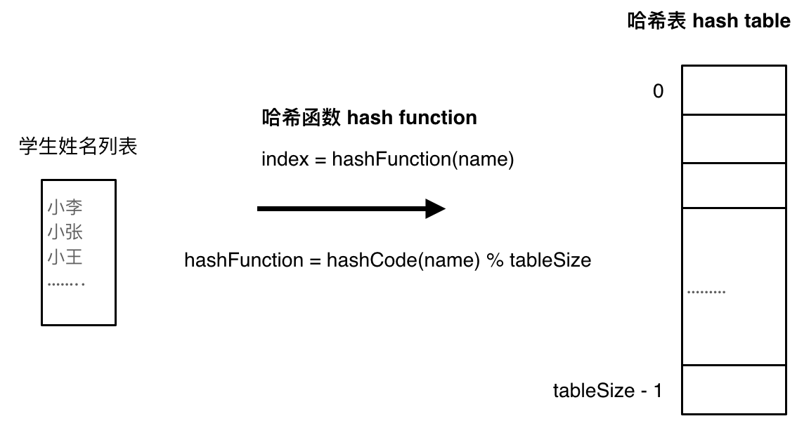
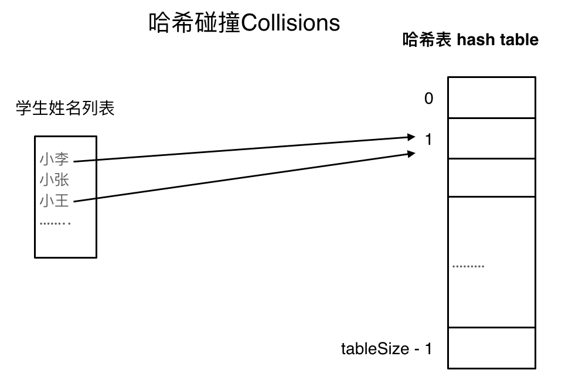
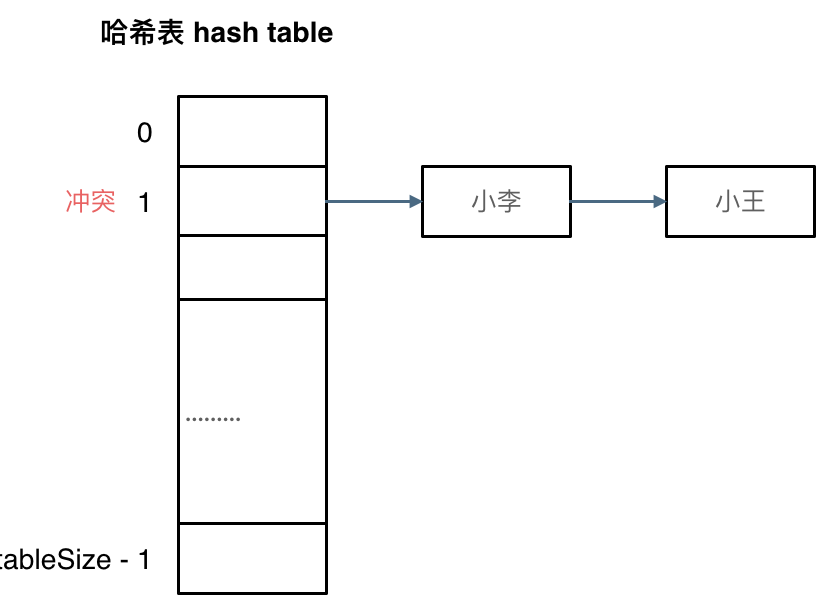
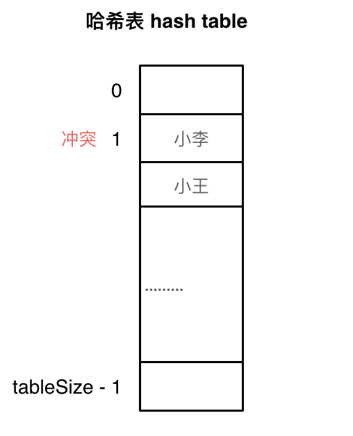

# 哈希表part 1
## 哈希表理论基础
什么时候要想到用哈希法：**当我们遇到了要快速判断一个元素是否出现在集合里的时候，就要考虑哈希法**，但是哈希法也是牺牲了空间换取了时间，因为我们要使用额外的数组，set或者是map来存放数据，才能实现快速的查找。

例如要查询一个名字是否在这所学校里。

要枚举的话时间复杂度是O(n)，但如果使用哈希表的话， 只需要O(1)就可以做到。

我们只需要初始化把这所学校里学生的名字都存在哈希表里，在查询的时候通过索引直接就可以知道这位同学在不在这所学校里了。

将学生姓名映射到哈希表上就涉及到了hash function ，也就是哈希函数。

### 哈希函数

哈希函数，把学生的姓名直接映射为哈希表上的索引，然后就可以通过查询索引下标快速知道这位同学是否在这所学校里了。

哈希函数如下图所示，通过hashCode把名字转化为数值，一般hashcode是通过特定编码方式，可以将其他数据格式转化为不同的数值，这样就把学生名字映射为哈希表上的索引数字了。




#### 如果HashCode得到的数值大于哈希表table size:

再次对数值进行取模的操作

#### 如果元素的数量大于哈希表table size:

哈希碰撞

### 哈希碰撞



（数据规模是dataSize， 哈希表的大小为tableSize）

一般哈希碰撞有两种解决方法，拉链法和线性探测法

#### 拉链法

将发生冲突的元素都存储在链表中



拉链法需要选择适当的哈希表大小，这样既不会因为数组空值而浪费大量内存，也不会因为链表太长而在查找上浪费太多时间

#### 线性探测法

使用线性探测法，一定要保证tableSize大于dataSize。我们需要依靠哈希表中的空位来解决碰撞问题。

例如冲突的位置，放了小李，那么就向下找一个空位放置小王的信息。所以要求tableSize一定要大于dataSize ，要不然哈希表上就没有空置的位置来存放 冲突的数据了。如图所示：



### 常见的三种哈希结构

* 数组
* set 集合
* map 映射

## 242.有效的字母异位词

三种哈希结构的使用选择：

* 数组：哈希值比较小，范围小且可控，如a-z
* set：如果数值很大
* map

数组在哈希表里的应用

### 补充知识
"a"的类型为String，而'a'为char，是基本数据类型(primitive type)

java中的char实际上是一个16位整数 (Unicode)

Java中char可以参与运算：

`System.out.println('a' + 1);`

输出:

`98`

因为:

```
'a' = 97;
97 + 1 = 98;
```

但：

`System.out.println("a" + 1);`

输出：

`a1`

字符串其实是char数组

以下是我的实现：

```
class Solution {
    public boolean isAnagram(String s, String t) {
        if (s.length() != t.length()){
            return false;
        }

        int[] hash = new int[26];

        for (int i=0; i<s.length(); i++){
            hash[s.charAt(i) - 'a'] ++;
            hash[t.charAt(i) - 'a'] --;
        }

        for (int num : hash){
            if (num != 0){
                return false;
            }
        }
        
        return true;
    }
}
```

## 349.两个数组的交集
有使用Array和Set两种解法

## 202.快乐数
使用Set来解决，可以发现这道题中要存储的元素的数量和大小都不固定，固可以使用Set

## 1.两数之和
用map时如何决定键和值：取决于我们要查找什么，把要查找的设置为key

数组的大小是受限制的，而且如果元素很少，而哈希值太大会造成内存空间的浪费。

set是一个集合，里面放的元素只能是一个key，而两数之和这道题目，不仅要判断y是否存在而且还要记录y的下标位置，因为要返回x 和 y的下标。所以set 也不能用。

四个重点：

* 为什么会想到用哈希表
	* 因为要查询元素是否出现过 
* 哈希表为什么用map
	* 如上，数组和set无法满足需求，数组如果哈希值太大会浪费空间，Set只能放key，却无法保存下标

* 本题map是用来存什么的
	* 存遍历过的值和对应的下标

* map中的key和value用来存什么的
	* key用来存值，因为我们需要频繁查询其是否出现过，value用来存其对应的下标，因为乳沟它出现过我们就需要知道它在原数组中的位置

以下是我的实现：

```
class Solution {
    public int[] twoSum(int[] nums, int target) {
        Map<Integer, Integer> appear = new HashMap<>();
        int[] inx = new int[2];
        for (int i=0; i < nums.length; i++){
            int res = target - nums[i];
            appear.put(nums[i], i);
            if (appear.containsKey(res)){
                inx[0] = i;
                inx[1] = appear.get(res);
                return inx;
            }
            
        }
        return inx;
    }
}
```


