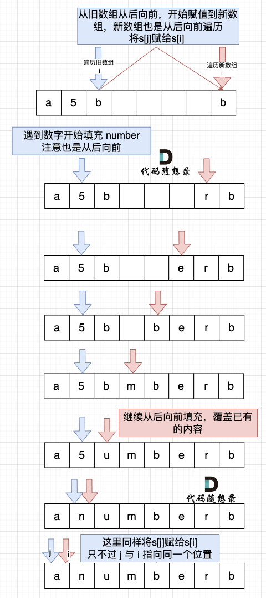

# 字符串 part 1
## 344.反转字符串
可以使用双指针法来解

## 541.反转字符串2
在344的基础上，通过i每次增加2k个来进行遍历

## 卡码网：54.替换数字
首先扩充数组到替换数字后的长度，随后从后向前填充。具体填充实现可使用双指针法，i指向新长度的末尾，j指向旧长度的末尾。过程如下：

### 为什么要从后向前填充，从前向后填充不行么？

从前向后填充就是O(n^2)的算法了，因为每次添加元素都要将添加元素之后的所有元素整体向后移动。

其实很多数组填充类的问题，**其做法都是先预先给数组扩容带填充后的大小，然后在从后向前进行操作。**

这么做有两个好处：

* 不用申请新数组。
* 从后向前填充元素，避免了从前向后填充元素时，每次添加元素都要将添加元素之后的所有元素向后移动的问题。